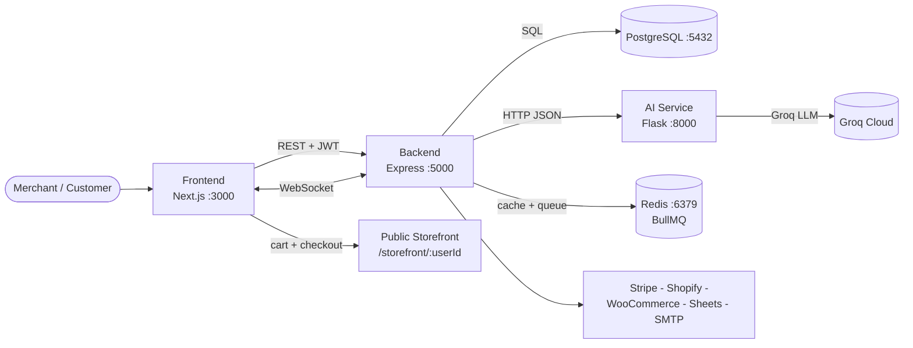

# Smart Business Assistant

> An AI-powered all-in-one platform for SMEs: manage products, sales, customers & storefront — with sales forecasting, anomaly detection, sentiment analysis, smart recommendations, chatbot copilot, reports, and multi-tenant organizations.

[](#tech-stack)
[](#run-with-docker-recommended)
[](#internationalization-i18n)
[](#key-features)

---

## Table of Contents

- [What is this?](#what-is-this)
- [Key Features](#key-features)
- [Architecture](#architecture)
- [Tech Stack](#tech-stack)
- [Monorepo Structure](#monorepo-structure)
- [Prerequisites](#prerequisites)
- [Environment Variables](#environment-variables)
- [Run with Docker (recommended)](#run-with-docker-recommended)
- [Run Locally (without Docker)](#run-locally-without-docker)
- [Database & Migrations](#database--migrations)
- [Backend API Reference](#backend-api-reference)
- [AI Service Reference](#ai-service-reference)
- [Frontend Routes](#frontend-routes)
- [Roles & Permissions](#roles--permissions)
- [AI Models Explained](#ai-models-explained)
- [Storefront (Public E‑commerce)](#storefront-public-ecommerce)
- [Internationalization (i18n)](#internationalization-i18n)
- [Realtime, Jobs & Caching](#realtime-jobs--caching)
- [Reports & Backups](#reports--backups)
- [Security](#security)
- [Troubleshooting](#troubleshooting)
- [Roadmap](#roadmap)
- [Contributing](#contributing)

---

## What is this?

**Smart Business Assistant (SBA)** helps small businesses centralize daily operations and make data-driven decisions:

1. **Operate** — products, categories, sales, stock, users, organizations, store settings.
2. **Understand** — dashboards, KPIs, charts, anomaly alerts, review sentiment.
3. **Predict & Act** — 6–12 month sales forecasts (polynomial regression), restock/promo recommendations, AI copilot/chatbot (Groq LLM + fallback rules).
4. **Sell Online** — customizable public storefront (`/storefront/[userId]`) with cart, checkout, reviews, merchant branding.
5. **Integrate & Scale** — Stripe, Shopify, WooCommerce, Google Sheets, CSV import/export, PDF reports, WebSockets, Redis + BullMQ, Docker.

Currency is **MAD (Moroccan Dirham)** throughout sales, predictions, and storefront.

---

## Key Features

### 🏢 Multi-tenant Organizations & Auth
- JWT auth (`sba_token` cookie + `Authorization: Bearer`), register/login, profile, avatar upload.
- Organizations, invitations by email (Nodemailer/SMTP), role-based access (`admin`, `manager`, `user`).
- Platform admin panel (`/admin`, `/admin-users`, `/admin-settings`): manage users (add/edit/delete), system settings, maintenance mode.
- Demo account auto-seeded; dedicated `admin@smartbusiness.com` platform admin.

### 📦 Catalog & Sales
- Products CRUD with images (`/uploads/products`), cost price, soft-delete (`deleted_at`), promotions, stock auto-sync on storefront orders.
- Categories per-user with colors, auto-seeded from existing products.
- Manual sales CRUD + CSV bulk import (`POST /api/csv/import`, `GET /api/csv/template`), mapping validation via AI `CSVAnalyzer`.
- Product stats trigger (`009_product_stats_trigger.sql`) keeps aggregates fresh.

### 📊 Dashboard & Analytics
- KPIs: revenue, orders, average basket, top products, last sales, monthly targets.
- Charts (Recharts + custom theme): revenue trends, category distribution, predictions vs history.
- Pages: `/dashboard`, `/sales`, `/products`, `/predictions`, `/anomalies`, `/recommendations`, `/reviews`, `/reports`, `/backup`, `/security`, `/dashboard/storefront` (merchant editor).

### 🤖 AI Copilot
- Backend proxy `backend/lib/aiClient.js` + `ai-enhancer.js` → Flask AI at `AI_SERVICE_URL`.
- Endpoints: `/api/ai-copilot/*`, `/api/analysis/*`, `/api/visualization/*`, `/api/chatbot`.
- Groq LLM (`GROQ_API_KEY`) for contextual chat with graceful rule-based fallback (`chatbot_service.py`).

### 🛒 Storefront (Public E‑commerce)
- Public SEO-friendly shop: `GET /api/storefront/:userId`, `frontend/pages/storefront/[userId].js`.
- Cart (`frontend/lib/cart.js`), checkout → creates real `sales` rows + decrements stock, order tracking, reviews (`ReviewForm.js`), merchant logo/banner (`/uploads/logos`), custom colors/pages, contact page.
- Merchant editor at `/dashboard/storefront` (79k lines: theme, sections, SEO, promos).

### 📄 Reports, Backup, Integrations
- Reports: filtered sales/product reports, export PDF (PDFKit) — `GET /api/reports/export.pdf`.
- Backup: full DB dump/restore (`/api/backup`, BullMQ queue), local `backups/` + scheduled jobs.
- Integrations: Stripe payments/webhooks, Shopify & WooCommerce sync, Google Sheets OAuth2 + push/pull.

### 🌍 UX & Theme
- Light beige + forest-green palette (`#1C352D`, `#2E6B72`), frosted-glass modals, Tailwind + Framer Motion, 3D hero (`@react-three/fiber/drei`, `three`, `GradientWaves`, `VantaTrunk`).
- Trilingual UI (EN/FR/AR) via `frontend/lib/translations.js` (120k) + `LanguageContext.js`. RTL-ready.
- `Layout.js`, `PageHeader.js`, `PortalAuthPill.js`, `Drawer.js`, `Chatbot.js` floating assistant.

---

## Architecture



- **Frontend** (`frontend/`, Next.js 14 `output: standalone`) calls backend via `lib/api.js` (`apiGet/apiPost/apiPut/apiDelete`) with JWT from `sba_token` cookie.
- **Backend** (`backend/server.js`) mounts 17 routers under `/api/*`, serves `/uploads/*`, enforces CORS + rate-limit, emits Socket.IO events.
- **AI** (`ai/app.py`, Flask + Gunicorn) is stateless: predict / sentiment / anomalies / recommendations / chatbot / analyze-csv. Config in `ai/config.py`.
- **Data** in Postgres (`backend/db/migrations/` + idempotent `migrate.js`); Redis optional for cache/queues; uploads on disk.

---

## Tech Stack

| Layer | Tech |
|---|---|
| Frontend | Next.js 14, React 18, Tailwind 3, Framer Motion, Recharts, lucide-react, react-hot-toast, date-fns, js-cookie, socket.io-client, Three.js / fiber / drei, OGL |
| Backend | Node 22, Express 4, pg, jsonwebtoken, bcryptjs, multer, pdfkit, qrcode, csv-parser, nodemailer, stripe, googleapis, speakeasy, express-validator, express-rate-limit, Socket.IO, BullMQ, Redis, axios |
| AI | Python 3.11, Flask 3 + CORS, Gunicorn, scikit-learn, pandas, numpy, groq, python-dotenv |
| Data / Infra | PostgreSQL 15, Redis 7, Docker + Compose, local file uploads |

---

## Monorepo Structure

```
smart-business-assistant/
├── backend/               # Express API (:5000)
│   ├── server.js          # entry: CORS, rate-limit, 17 routers, /uploads static, WS init
│   ├── routes/            # auth, organizations, invitations, integrations, ai-copilot,
│   │                      # dashboard, security, visualization, backup, reports, products,
│   │                      # categories, sales, analysis, csv, chatbot, admin, storefront, store-settings
│   ├── middleware/        # auth (JWT), permissions (RBAC), rateLimit, audit
│   ├── lib/               # aiClient, ai-enhancer, dataAggregator, email, googleSheets,
│   │                      # shopify, woocommerce, stripe, redis, queue, security, websocket, backup
│   ├── db/migrations/     # 001_organizations ... 010_users_role_manager
│   └── Dockerfile
├── frontend/              # Next.js app (:3000)
│   ├── pages/             # index, login, register, dashboard, products, sales, predictions,
│   │                      # anomalies, recommendations, reviews, reports, backup, security,
│   │                      # admin, admin-users, admin-settings, profile, docs, contact, privacy, terms
│   │                      # + dashboard/storefront + storefront/[userId]
│   ├── components/        # Layout, PageHeader, Chatbot, Drawer, ReviewForm, PortalAuthPill, GradientWaves
│   ├── lib/               # api, auth, cart (MAD), money, format, chartTheme, translations (en/fr/ar)
│   └── Dockerfile         # multi-stage builder -> runner
├── ai/                    # Flask AI service (:8000)
│   ├── app.py             # /health /predict /sentiment /anomalies /recommendations /chatbot /analyze-csv
│   ├── core/              # validator, preprocessor, data_loader, exceptions
│   ├── models/            # prediction, sentiment, anomaly, recommendation
│   ├── services/          # llm_chatbot (Groq), chatbot_service (fallback), csv_service
│   └── Dockerfile         # python:3.11-slim + gunicorn workers 2
├── uploads/avatars|logos|products
├── backups/
├── docker-compose.yml
├── .env.example / DOCKER.md
└── README.md
```

## Prerequisites

- **Docker path:** Docker Desktop 4+ + Compose v2 (easiest).
- **Local path:** Node.js 22+, Python 3.11+, PostgreSQL 15+, Redis 7+ (optional but recommended).
- Optional keys: `GROQ_API_KEY` (LLM chatbot), SMTP creds (invites), Stripe keys, Google OAuth (Sheets).

---

## Environment Variables

```bash
cp .env.example .env
```

| Key | Used by | Default | Notes |
|---|---|---|---|
| `DB_HOST`/`DB_PORT`/`DB_NAME`/`DB_USER`/`DB_PASSWORD` | backend, compose | `localhost:5432 / smart_business_assistant` | Compose overrides to `postgres` / `redis`. |
| `JWT_SECRET` | backend | min 32 chars | **Required in production.** |
| `JWT_EXPIRES_IN` | backend | `24h` |  |
| `PORT` | backend | `5000` |  |
| `FRONTEND_URL` | backend CORS | `http://localhost:3000` | Add prod domain. |
| `NEXT_PUBLIC_API_URL` | frontend | `http://localhost:5000/api` | Baked at `next build` — rebuild if changed. |
| `NEXT_PUBLIC_AI_URL` | frontend | `http://localhost:8000` | Mostly informational; backend proxies AI. |
| `AI_SERVICE_URL` | backend | `http://localhost:8000` | Compose sets `http://ai:8000`. |
| `SMTP_HOST/PORT/SECURE/USER/PASS`, `EMAIL_FROM` | backend | Gmail example | Optional; invites still created if unset. |
| `STRIPE_SECRET_KEY`, `STRIPE_WEBHOOK_SECRET` | backend | `sk_test_...` | Optional. |
| `GOOGLE_CLIENT_ID/SECRET/REDIRECT_URI` | backend | — | Optional; Sheets integration. |
| `REDIS_HOST/PORT/PASSWORD` | backend | commented | Optional locally; features degrade gracefully. |
| `RATE_LIMIT_WINDOW_MS`/`RATE_LIMIT_MAX_REQUESTS` | backend | `900000 / 100` |  |
| `GROQ_API_KEY` | ai | `gsk_...` | Optional; rule fallback works without it. |

> Never commit `.env` (already in `.gitignore`).

---

## Run with Docker (recommended)

```bash
cp .env.example .env   # edit DB_PASSWORD, JWT_SECRET, URLs...
docker compose up --build

# Frontend:  http://localhost:3000
# Backend:   http://localhost:5000/api/health
# AI:        http://localhost:8000/health
# Postgres:  localhost:5432 | Redis: localhost:6379
```

Compose starts `postgres:15-alpine` + `redis:7-alpine` (healthchecks + volumes), `backend` (`node db/migrate.js && node server.js`, mounts `./uploads:/uploads`), `ai` (`gunicorn app:app --bind 0.0.0.0:8000 --workers 2`), `frontend` (standalone `node server.js` on `:3000`).

```bash
docker compose ps
docker compose logs -f backend ai frontend postgres
docker compose down            # stop
docker compose down -v         # stop + wipe DB/Redis volumes
docker compose up --build backend  # rebuild one service
```

> See [`DOCKER.md`](./DOCKER.md) for dev mounts, port conflicts, prod notes.

---

## Run Locally (without Docker)

```bash
# 0) Env + DB
cp .env.example .env
createdb smart_business_assistant

# 1) Backend (:5000) — auto-migrates via predev/prestart
cd backend
npm install
npm run dev

# 2) AI (:8000)
cd ../ai
python -m venv venv
venv\Scripts\activate        # Windows (or: source venv/bin/activate)
pip install -r requirements.txt
python app.py

# 3) Frontend (:3000)
cd ../frontend
npm install --legacy-peer-deps
npm run dev
```

Seeded accounts (via `migrate.js`): `admin@smartbusiness.com` (role `admin`, default password `admin123` — change immediately) and `demo@smartbusiness.com` (role `user`).

---

## Database & Migrations

- Ordered SQL in `backend/db/migrations/*.sql`, executed by `backend/db/migrate.js` (also `prestart`/`predev` + compose command).
- Chain: `001_organizations` (users, orgs, products, sales, reviews, targets, anomalies...) -> `002_storefront_fields` -> `003_store_settings` -> `004_storefront_customization` -> `005_add_ai_columns` -> `006_store_settings_extend` -> `007_product_promotions` -> `009_product_stats_trigger` -> `010_users_role_manager` (+ inline: notifications, system_settings, categories backfill, avatar/language/2FA, demo data move).
- Idempotent (`IF NOT EXISTS` / `ON CONFLICT DO NOTHING`) — safe to re-run: `cd backend && node db/migrate.js`.

---

## Backend API Reference

Base: `http://localhost:5000/api`. Auth `Authorization: Bearer <JWT>` unless **public**.

| Prefix | File | Purpose |
|---|---|---|
| `GET /health` | `server.js` | **public** liveness probe. |
| `/auth` | `routes/auth.js` | Register, login, me, profile/avatar, password, 2FA (speakeasy), sessions. |
| `/organizations` | `routes/organizations.js` | Orgs + members + roles (multi-tenant). |
| `/invitations` | `routes/invitations.js` | Invite by email (SMTP), accept/decline, resend. |
| `/admin` | `routes/admin.js` | List/add/edit/delete users, roles, system settings, stats. |
| `/products` | `routes/products.js` | CRUD + image upload (`uploads/products`), promo, soft-delete/restore, stock adjust. |
| `/categories` | `routes/categories.js` | Per-user categories + colors. |
| `/sales` | `routes/sales.js` | CRUD sales, filters (date/product/category), MAD totals. |
| `/storefront` | `routes/storefront.js` | **public** `GET /:userId`; `POST /:userId/checkout` (creates sales + decrements stock); reviews `GET/POST /:userId/reviews`. |
| `/store-settings` | `routes/store-settings.js` | Branding, theme, sections, SEO, contact, logo/banner upload. |
| `/dashboard` | `routes/dashboard.js` | KPIs, revenue series, top products, last sales, targets. |
| `/analysis` | `routes/analysis.js` | Aggregates + AI proxy (`dataAggregator.js`). |
| `/ai-copilot` | `routes/ai-copilot.js` | Contextual chat (`aiClient.js`, `ai-enhancer.js`). |
| `/chatbot` | `routes/chatbot.js` | Lightweight QA proxy to AI service. |
| `/visualization` | `routes/visualization.js` | Chart-ready datasets. |
| `/reports` | `routes/reports.js` | Filtered reports + `GET /export.pdf` (PDFKit) + CSV. |
| `/csv` | `routes/csv.js` | `GET /template`, `POST /import` (csv-parser + validation). |
| `/integrations` | `routes/integrations.js` | Stripe, Shopify, WooCommerce, Google Sheets OAuth. |
| `/security` | `routes/security.js` | 2FA, login history, audit log. |
| `/backup` | `routes/backup.js` | Dump/restore via BullMQ, files in `backups/`. |

```bash
curl http://localhost:5000/api/health
curl -X POST http://localhost:5000/api/auth/login -H "Content-Type: application/json" \
  -d '{"email":"demo@smartbusiness.com","password":"demo123"}'
curl http://localhost:5000/api/products -H "Authorization: Bearer <JWT>"
curl http://localhost:5000/api/storefront/2   # public shop
```

---

## AI Service Reference

Base: `http://localhost:8000` (`ai/app.py`). Config: `ai/config.py`.

| Endpoint | Input | Output |
|---|---|---|
| `GET /health` | — | `{"status":"ok"}` |
| `POST /predict` | `{"sales":[...], "horizon":6}` (>=6 pts) | Degree-2 polynomial forecast, horizon clamped 1-12. |
| `POST /sentiment` | `{"text":"..."}` | Label + score (FR/EN/AR lexicon, negation window 3). |
| `POST /anomalies` | `{"sales":[...], "products":[...], "lang":"en"}` | z-score (>1.5, >=4 pts) + stock (<25% high, <10% critical). |
| `POST /recommendations` | `{"anomalies":[],"products":[],"sales_stats":{},"reviews_stats":{}}` | Restock/promo/pricing actions (high-impact >=10000 MAD/mo). |
| `POST /chatbot` | `{"question":"...","products":[],"sales_stats":{},"history":[]}` | Groq LLM answer or rule fallback. Needs `GROQ_API_KEY` for LLM. |
| `POST /analyze-csv` | `multipart file=.csv` | Column mapping, row stats, errors. |

```bash
curl -X POST http://localhost:8000/predict -H "Content-Type: application/json" \
  -d '{"sales":[8000,9500,11000,10500,13000,14200],"horizon":6}'
```

---

## Frontend Routes

| Route | Access | Description |
|---|---|---|
| `/` | **public** | Landing + 3D hero, auth-aware pill. |
| `/login`, `/register` | **public** | JWT via `sba_token` cookie, redirect `/dashboard`. |
| `/dashboard` | auth | KPIs, charts, last sales, targets, AI insights. |
| `/products` | auth | Catalog grid + CRUD modal, promos, stock badges. |
| `/sales` | auth | Table + filters + manual entry + CSV import. |
| `/predictions` | auth | History vs 6-12 mo forecast (MAD). |
| `/anomalies` | auth | Spikes/dips + low-stock alerts. |
---

## Roles & Permissions

Enforced by `backend/middleware/permissions.js` + `routes/admin.js`:

| Capability | `user` | `manager` | `admin` |
|---|---|---|---|
| Own products/sales/categories/storefront | yes | yes | yes (all users) |
| Invite org members | — | yes | yes |
| Backups/reports/audit (own scope vs global) | own | yes | global |
| Manage any user (add/edit/delete, roles) | — | — | yes (`/admin-users`) |
| System settings + maintenance | — | — | yes (`/admin-settings`) |

`010_users_role_manager.sql` adds `manager`; `migrate.js` keeps exactly one `admin@smartbusiness.com` platform admin.

---

## AI Models Explained

- **Forecasting** (`ai/models/prediction.py`): sklearn degree-2 polynomial on monthly revenue. Needs >=6 months, predicts 6 (default) up to 12.
- **Sentiment** (`ai/models/sentiment.py`): lexicon FR/EN/AR, thresholds 0.65/0.35, negation window 3.
- **Anomaly** (`ai/models/anomaly.py`): sales z-score |z|>1.5 (>=4 pts); stock <25% high / <10% critical. Localized via `lang`.
- **Recommendations** (`ai/models/recommendation.py`): reorder qty, slow-mover promos, pricing nudges when >20% negative reviews, flag >=10000 MAD/mo.
- **Chatbot**: `services/llm_chatbot.py` (Groq + context/history) with `services/chatbot_service.py` regex fallback offline.

---

## Storefront (Public E-commerce)

- Link: `http://localhost:3000/storefront/<userId>`.
- Checkout (`POST /api/storefront/:userId/checkout`): validates stock -> inserts `sales` -> decrements `products.stock` -> emits `sale:created` -> clears cart.
- Reviews (`POST /:userId/reviews`, rating 1-5) scored for sentiment async.
- Customization: name, slug, logo/banner (`uploads/logos`), color, announcement bar, featured products, SEO, contact, Maps embed. Prices via `lib/money.js` in MAD.

---

## Internationalization (i18n)

- `frontend/lib/translations.js` (en/fr/ar) + `LanguageContext.js`; persisted in `users.language` + localStorage. RTL when `ar`.
- AI accepts `"lang"` for localized anomaly/recommendation messages.
- Add a key to all 3 locales, use `useLanguage()` -> `t('ns.key')`.

---

## Realtime, Jobs & Caching

- **WebSocket** (`backend/lib/websocket.js`, Socket.IO, rooms per `userId`): `sale:created`, `stock:low`, `anomaly:new`, `notification:new`. Client: `frontend/lib/websocket.js`.
- **Redis** (`lib/redis.js`): caches dashboard + predictions (TTL 5-15 min); skipped if `REDIS_HOST` unset.
- **BullMQ** (`lib/queue.js`): `backup`, `report` (PDF), `sync` (Shopify/Woo/Sheets) queues; inline fallback locally.

---

## Reports & Backups

- **Reports** (`routes/reports.js` + `pages/reports.js`): date/product/category filters -> preview + Export PDF (PDFKit, MAD totals) or CSV.
- **Backup** (`routes/backup.js`, `lib/backup.js`): `POST /api/backup/create` pg_dump -> `backups/*.dump`, restore + list/download/delete, progress via WebSocket (`/backup` page).

---

## Security

- JWT (`JWT_SECRET` >=32 chars, 24h), bcrypt 10 rounds, `sba_token` cookie + Bearer header.
- Global rate-limit (100 req / 15 min) + stricter login limiter; validation (`express-validator`) + parameterized SQL (`pg`).
- 2FA TOTP (`speakeasy` + `qrcode`), RBAC, audit (`audit_log`), `login_log`, CORS allowlist, multer file checks, product soft-delete, `.env` ignored.

---

## Troubleshooting

| Symptom | Fix |
|---|---|
| `Not allowed by CORS` | Set `FRONTEND_URL`, restart backend. |
| DB `Database Error` | `docker compose ps postgres`, check `DB_*`, `docker compose logs postgres`. |
| `NEXT_PUBLIC_*` ignored | Rebuild: `docker compose up --build frontend`. |
| Chatbot empty / Groq error | Check `GROQ_API_KEY`; rule fallback still works. See `docker compose logs ai`. |
| Redis `ECONNREFUSED` | Optional locally; leave commented or run `redis-server`. |
| Port in use | Remap in `docker-compose.yml` (e.g. `"3001:3000"`). |
| Migrations fail | `cd backend && node db/migrate.js`; check `db/pool.js` creds. |
| Images 404 `/uploads/*` | Ensure `uploads/` exists/mounted; backend serves `/uploads` statically. |

---

## Roadmap

- [ ] Tests (Jest/Vitest + Supertest, pytest) + CI.
- [ ] Low-stock push + email digests.
- [ ] Multi-currency (MAD default, EUR/USD toggle).
- [ ] PWA offline POS + barcode scanning.
- [ ] K8s manifests + managed Postgres/S3 uploads.
- [ ] Seasonal forecasting + review summarizer.

---

## Contributing

1. Fork + `git checkout -b feat/my-change`.
2. Conventions: Express routers `backend/routes/`, Next pages `frontend/pages/`, Flask models `ai/models/`.
3. Run all 3 services locally and test affected routes.
4. Update README + `.env.example` for new env/endpoint.
5. PR to `main` with screenshots for UI changes.

---

> Built with care for small businesses — Next.js - Express - Flask - PostgreSQL - Redis - Docker.

| `/recommendations` | auth | Restock / promo / pricing cards. |
| `/reviews` | auth | Reviews + sentiment badges + reply. |
| `/reports` | auth | Filters + preview + Export PDF/CSV. |
| `/backup` | auth admin/manager | Dump/restore + history. |
| `/security` | auth | 2FA QR, sessions, audit log. |
| `/dashboard/storefront` | auth | Shop editor (theme, sections, SEO, promos). |
| `/storefront/[userId]` | **public** | Customer shop: catalog, cart (`lib/cart.js`), checkout, reviews. |
| `/admin`, `/admin-users`, `/admin-settings` | `admin` | Stats, user CRUD + roles, settings + maintenance. |
| `/profile` | auth | Name/company/avatar/language/password/2FA. |
| `/docs`, `/contact`, `/privacy`, `/terms`, `/404` | **public** | Help, contact, legal, not-found. |

---
